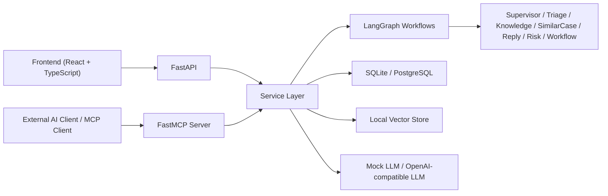

# 企业智能工单与知识库 Multi-Agent 平台

基于 FastAPI + RAG + LangGraph Multi-Agent + FastMCP 的企业级智能工单处理平台，面向客服、IT 支持、售后和 HR 服务台等场景，支持知识库检索、历史相似工单推荐、AI 回复草稿生成、人工审核、多 Agent 协作分析和 MCP 对外开放。

## 快速启动

### 后端

```bash
cd backend
D:\tools\anaconda\envs\py312\python.exe -m pip install -r requirements.txt
D:\tools\anaconda\envs\py312\python.exe -m app.db.init_db
D:\tools\anaconda\envs\py312\python.exe scripts/seed_data.py
D:\tools\anaconda\envs\py312\python.exe -m uvicorn app.main:app --reload --port 8010
```


后端地址：`http://localhost:8010`，Health 检查：`http://localhost:8010/health`

### 前端

```bash
cd frontend
npm install
npm run dev
```

前端地址：`http://localhost:5173`，默认通过 `/api` 代理请求到本地后端。

### 默认环境变量（mock 模式，无需真实 API Key）

```bash
DATABASE_URL=sqlite:///./backend/app.db
LLM_PROVIDER=mock
EMBEDDING_PROVIDER=fake
```

### 测试账号

| 角色 | 邮箱 | 密码 |
|------|------|------|
| Admin | admin@example.com | admin123 |
| Agent | agent@example.com | agent123 |
| Viewer | viewer@example.com | viewer123 |

## 项目背景

很多 AI 项目停留在“聊天机器人”层面，但企业实际更关心的是可控流程、审核机制、系统集成和业务闭环。这个项目以“企业工单系统”为主体，把 AI 能力嵌入到真实业务链路里：

- 工单创建、分诊、流转、审核和看板是一条完整闭环
- RAG 检索知识库并返回引用来源，而不是直接无依据生成
- AI 只输出建议，不直接发送客户回复
- Multi-Agent 过程带 `audit_trail`，便于解释和面试展示
- FastMCP 把企业能力开放给外部 AI Client，而不是只做 HTTP API

## 核心功能

- 用户登录与 JWT 鉴权
- 工单 CRUD、消息记录、状态流转
- 知识库上传、切分、Fake Embedding、本地向量检索
- AI 工单分类与 RAG 回复草稿生成
- Human-in-the-loop 人工审核：`approve / edit / reject`
- LangGraph 单流程工作流与 interrupt 审核流
- Multi-Agent 固定顺序工作流：
  `Supervisor -> Triage -> Knowledge -> SimilarCase -> Reply -> Risk -> Workflow`
- `audit_trail` 与 `AgentRunLog` 持久化
- FastMCP tools / resources / prompts
- Dashboard Analytics 数据看板
- Docker Compose 一键启动基础

## 技术栈

- 后端：FastAPI、SQLAlchemy、Pydantic、JWT
- 前端：React 18、TypeScript、Vite、Axios、React Router
- AI / RAG：Mock LLM、OpenAI-compatible LLM、Fake Embedding、本地 JSON 向量存储
- 工作流：LangGraph
- MCP：FastMCP
- 数据库：SQLite 默认，PostgreSQL 可选
- 部署：Docker Compose、Nginx

## 系统架构



更完整的架构说明见 [docs/ARCHITECTURE.md](/E:/Bawa_Data/Xiangmu/My-platform/docs/ARCHITECTURE.md)。

## 关键业务流程

### 1. RAG 检索流程

```text
Upload document
-> parse txt/md
-> chunk document
-> fake embedding
-> local vector index
-> semantic search
-> reply draft with source citations
```

### 2. 单流程 LangGraph

```text
START
-> load_ticket
-> classify_ticket
-> retrieve_knowledge
-> search_similar_tickets
-> generate_reply
-> risk_check
-> finalize
-> END
```

### 3. Multi-Agent 工作流

```text
START
-> load_ticket
-> supervisor
-> triage
-> knowledge
-> similar_case
-> reply
-> risk
-> workflow
-> human_review
-> finalize
-> END
```

### 4. Human-in-the-loop 安全边界

- AI 只生成分类结果、回复草稿和流程建议
- 客户回复必须经过人工 `approve / edit / reject`
- MCP 写操作默认 `dry_run=True`
- 高风险动作不默认暴露为 MCP tool

## 目录结构

```text
.
├── backend/
│   ├── app/
│   │   ├── api/
│   │   ├── agents/
│   │   ├── core/
│   │   ├── db/
│   │   ├── graphs/
│   │   ├── mcp/
│   │   ├── models/
│   │   ├── prompts/
│   │   ├── repositories/
│   │   ├── schemas/
│   │   └── services/
│   ├── scripts/
│   └── tests/
├── frontend/
│   └── src/
├── docs/
├── docker-compose.yml
└── README.md
```

## 当前已实现页面

- `/login`：登录页
- `/home`：Dashboard
- `/tickets`：工单列表
- `/tickets/new`：创建工单
- `/tickets/:ticketId`：工单详情、AI 建议审核、Multi-Agent 时间线
- `/knowledge`：知识库列表、上传和搜索
- `/knowledge/:docId`：知识文档详情和 chunk 展示

## 数据模型概览

核心实体包括：

- `users`
- `tickets`
- `ticket_messages`
- `knowledge_docs`
- `knowledge_chunks`
- `ai_suggestions`
- `ticket_embeddings`
- `audit_logs`
- `agent_run_logs`

详细说明见 [docs/ARCHITECTURE.md](/E:/Bawa_Data/Xiangmu/My-platform/docs/ARCHITECTURE.md) 与 [docs/API_DESIGN.md](/E:/Bawa_Data/Xiangmu/My-platform/docs/API_DESIGN.md)。

## API 概览

主要 HTTP API 分组：

- Auth：`/api/auth/login`、`/api/auth/me`
- Tickets：`/api/tickets`
- Knowledge：`/api/knowledge/*`
- AI：`/api/ai/*`
- Reviews：`/api/reviews/*`
- Analytics：`/api/analytics/overview`

完整接口清单见 [docs/API_DESIGN.md](/E:/Bawa_Data/Xiangmu/My-platform/docs/API_DESIGN.md)。

### API 示例

登录：

```bash
curl -X POST http://localhost:8010/api/auth/login ^
  -H "Content-Type: application/json" ^
  -d "{\"email\":\"admin@example.com\",\"password\":\"admin123\"}"
```

创建工单：

```bash
curl -X POST http://localhost:8010/api/tickets ^
  -H "Authorization: Bearer <TOKEN>" ^
  -H "Content-Type: application/json" ^
  -d "{\"title\":\"Enterprise renewal charged twice\",\"content\":\"The customer says the renewal was captured twice.\",\"customer_name\":\"Lena Foster\",\"customer_email\":\"lena.foster@example.com\",\"category\":\"payment\",\"priority\":\"urgent\"}"
```

运行 Multi-Agent：

```bash
curl -X POST http://localhost:8010/api/ai/tickets/1/multi-agent-process/start ^
  -H "Authorization: Bearer <TOKEN>"
```

知识库搜索：

```bash
curl -X POST http://localhost:8010/api/knowledge/search ^
  -H "Authorization: Bearer <TOKEN>" ^
  -H "Content-Type: application/json" ^
  -d "{\"query\":\"duplicate charge reversal\",\"top_k\":3}"
```

## FastMCP 能力

### Tools

- `search_knowledge_base`
- `get_ticket_detail`
- `list_open_tickets`
- `search_similar_tickets`
- `get_analytics_overview`
- `run_multi_agent_ticket_process`
- `get_agent_audit_trail`

### Resources

- `ticket://{ticket_id}`
- `knowledge-doc://{doc_id}`
- `analytics://overview`

### Prompts

- `classify_ticket_prompt`
- `generate_reply_prompt`
- `summarize_ticket_prompt`
- `risk_review_prompt`

### 本地启动 MCP Server

```bash
cd backend
D:\tools\anaconda\envs\py312\python.exe -m app.mcp.server
```

### MCP Client 验证脚本

```bash
cd backend
D:\tools\anaconda\envs\py312\python.exe scripts/test_mcp_client.py
```

## 本地启动

### 1. 后端

```bash
cd backend
D:\tools\anaconda\envs\py312\python.exe -m pip install -r requirements.txt
D:\tools\anaconda\envs\py312\python.exe -m app.db.init_db
D:\tools\anaconda\envs\py312\python.exe scripts/seed_data.py
D:\tools\anaconda\envs\py312\python.exe -m uvicorn app.main:app --reload --port 8010
```

后端地址：

- API Base：`http://localhost:8010`
- Health：`http://localhost:8010/health`

### 2. 前端

```bash
cd frontend
npm install
npm run dev
```

前端地址：

- UI：`http://localhost:5173`

默认前端通过 `/api` 代理请求本地 `http://localhost:8010`。

### 3. 默认环境变量

项目默认以 mock 模式运行，无需真实 API Key：

```bash
DATABASE_URL=sqlite:///./backend/app.db
LLM_PROVIDER=mock
EMBEDDING_PROVIDER=fake
```

环境变量示例见 [.env.example](/E:/Bawa_Data/Xiangmu/My-platform/.env.example)。

## Docker Compose 启动

默认 Compose 行为：

- 默认使用 SQLite 持久化卷
- 默认 `LLM_PROVIDER=mock`
- 默认 `EMBEDDING_PROVIDER=fake`
- 启动时自动执行 `init_db` 和 `seed_data.py`
- `postgres` / `redis` 为可选 profile

启动默认栈：

```bash
docker compose up --build
```

启动带可选服务的栈：

```bash
docker compose --profile postgres --profile redis up --build
```

Compose 默认访问地址：

- 前端：`http://localhost:5173`
- 后端：`http://localhost:8000`
- Health：`http://localhost:8000/health`

### 当前 Docker 验证说明

截至 2026-06-02：

- `docker compose config` 已通过
- `docker compose --profile postgres --profile redis config` 已通过
- 当前机器未完成真实 `docker compose up --build` 运行验收

原因是本机 Docker daemon 未启动，错误为：

```text
failed to connect to the docker API at npipe:////./pipe/dockerDesktopLinuxEngine
The system cannot find the file specified
```

这意味着 Compose 配置已写好，但还缺一次在 Docker Desktop 正常运行环境中的最终启动验收。

## 测试账号

- `admin@example.com / admin123`
- `agent@example.com / agent123`
- `viewer@example.com / viewer123`

## 演示数据

`backend/scripts/seed_data.py` 会生成：

- 3 篇知识库文档：支付、发票、退款
- 多条历史已解决工单
- 多条当前待处理工单
- 多种状态的 AI suggestion：`draft / approved / edited / rejected`

其中很适合演示的案例包括：

- 重复扣费企业续费工单
- 月末前发票修正工单
- 延迟激活后的部分退款请求
- SSO 迁移后无法进入 billing portal 的账号问题

## 验证方式

### 后端测试

```bash
cd backend
D:\tools\anaconda\envs\py312\python.exe -m pytest
```

当前已覆盖的 smoke tests 包括：

- `health`
- `login`
- `ticket CRUD`
- `knowledge upload/search`
- `AI mock classification`
- `RAG reply generation`

### 前端构建

```bash
cd frontend
npm run build
```

## 推荐演示流程

简版流程：

1. 用 `admin@example.com` 登录
2. 进入 Dashboard 展示指标卡和 AI adoption
3. 打开 Tickets 列表，选择重复扣费工单
4. 在 Ticket Detail 中展示 AI classification
5. 生成 RAG 回复草稿并查看引用来源
6. 演示人工审核 `approve / edit / reject`
7. 运行 Multi-Agent 分析，展示每个 Agent 输出和 `audit_trail`
8. 进入 Knowledge 页面，展示文档搜索和 chunk 详情
9. 演示 MCP server 与 `test_mcp_client.py`

完整讲解脚本见 [docs/DEMO_SCRIPT.md](/E:/Bawa_Data/Xiangmu/My-platform/docs/DEMO_SCRIPT.md)。

## 文档索引

- [架构设计](/E:/Bawa_Data/Xiangmu/My-platform/docs/ARCHITECTURE.md)
- [API 设计](/E:/Bawa_Data/Xiangmu/My-platform/docs/API_DESIGN.md)
- [演示脚本](/E:/Bawa_Data/Xiangmu/My-platform/docs/DEMO_SCRIPT.md)
- [后端函数说明](/E:/Bawa_Data/Xiangmu/My-platform/docs/BACKEND_APP_FUNCTION_GUIDE.md)
- [项目结构说明](/E:/Bawa_Data/Xiangmu/My-platform/docs/PROJECT_STRUCTURE_GUIDE.md)
- [项目交接](/E:/Bawa_Data/Xiangmu/My-platform/docs/PROJECT_HANDOFF.md)

## 简历包装

### 一句话描述

面向企业客服 / IT 支持场景的智能工单处理平台，集成 RAG、LangGraph Multi-Agent、人工审核和 FastMCP，对外提供可控、可解释、可审计的 AI 工具能力。

### 项目描述

设计并实现一个企业级智能工单与知识库平台，覆盖工单管理、知识库检索、历史相似工单推荐、AI 回复草稿生成、人工审核、Multi-Agent 协作分析和数据看板；通过 LangGraph 编排 Supervisor、Triage、Knowledge、SimilarCase、Reply、Risk、Workflow 等角色型 Agent，并使用 FastMCP 将核心能力开放给外部 AI Client。

### 简历亮点要点

- 基于 FastAPI 分层架构实现企业工单业务闭环，覆盖认证、工单、知识库、AI 审核、审计日志和 Analytics 看板
- 构建知识库 RAG 流程，支持文档上传、切分、向量索引和语义检索，并在 AI 回复中返回引用来源
- 使用 LangGraph 设计可控单流程和 Multi-Agent 工作流，并通过 `audit_trail` 记录每个 Agent 的执行轨迹
- 设计 Human-in-the-loop 审核机制，确保 AI 仅生成草稿而不直接发送客户回复
- 通过 FastMCP 暴露 `search_knowledge_base`、`get_ticket_detail`、`run_multi_agent_ticket_process` 等标准 MCP 能力
- 采用 mock LLM 和 fake embedding 保证无真实密钥时也可本地运行与演示

### 面试时可重点展开的话题

- 为什么 AI 回复必须经过人工审核
- Multi-Agent 相比单链路流程的价值是什么
- `audit_trail` 如何提升可解释性和录屏演示效果
- 为什么 MCP 要与 FastAPI 并存，而不是互相替代
- mock 模式如何保证本地开发、测试和 Docker 演示可复现

## 未来优化方向

- 将 `InMemorySaver` 替换为可持久化的 workflow checkpoint 存储
- 将 fake embedding / JSON 向量索引升级为 pgvector 或 Chroma
- 为 Multi-Agent、MCP、Analytics 增加更完整的自动化回归测试
- 增加前端组件测试和 e2e 测试
- 接入真实权限体系、SLA 规则和更精细的派单策略
