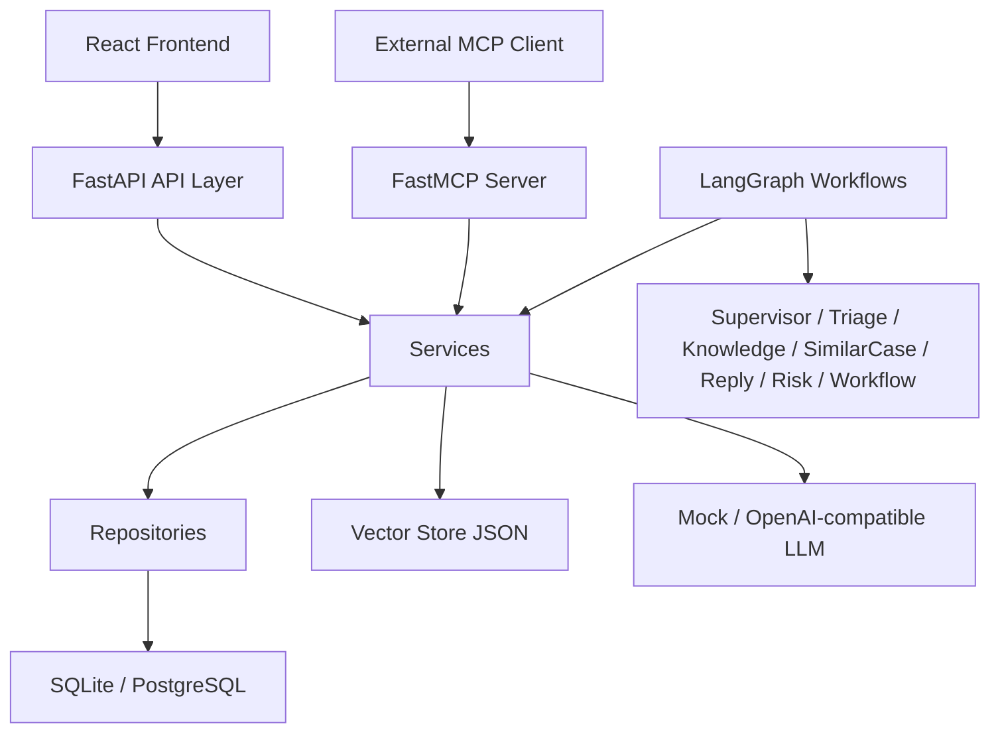
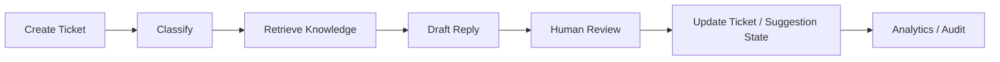
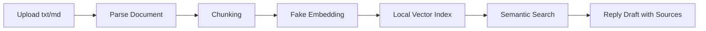

# Architecture

## 1. 项目定位

这是一个“企业业务系统 + AI 工作流”的项目，而不是通用聊天机器人。核心目标是把工单管理、RAG、人工审核、Multi-Agent 协作和 MCP 开放能力放到同一个可演示的平台中。

## 2. 架构总览



## 3. 分层原则

后端遵循以下分层：

```text
api/             HTTP 请求入口
schemas/         Pydantic 输入输出模型
models/          SQLAlchemy 模型
repositories/    数据访问
services/        业务逻辑复用层
agents/          单个 Agent 职责封装
graphs/          LangGraph 编排
mcp/             FastMCP tools/resources/prompts
db/              数据库连接与初始化
core/            配置与安全
```

关键原则：

- FastAPI、LangGraph、FastMCP 复用同一套 service
- API 层不写复杂业务逻辑
- Agent 不直接写复杂数据库查询
- MCP 不复制 service 逻辑

## 4. 主要业务闭环

### 4.1 工单闭环



### 4.2 RAG 流程



### 4.3 Multi-Agent 流程

```mermaid
flowchart LR
    START["START"] --> LOAD["load_ticket"]
    LOAD --> SUP["SupervisorAgent"]
    SUP --> TRI["TriageAgent"]
    TRI --> KNO["KnowledgeAgent"]
    KNO --> SIM["SimilarCaseAgent"]
    SIM --> REP["ReplyAgent"]
    REP --> RISK["RiskAgent"]
    RISK --> WF["WorkflowAgent"]
    WF --> HR["human_review"]
    HR --> FIN["finalize"]
    FIN --> END["END"]
```



## 5. Agent 职责划分

- `SupervisorAgent`：汇总工单上下文，规划本次固定顺序执行
- `TriageAgent`：分类、优先级、情绪、摘要、推荐部门
- `KnowledgeAgent`：生成查询词并检索知识库
- `SimilarCaseAgent`：召回历史已解决相似工单并总结经验
- `ReplyAgent`：整合工单、知识库和历史案例生成回复草稿
- `RiskAgent`：判断风险等级、低置信度和是否必须人工审核
- `WorkflowAgent`：推荐工单下一状态、建议部门和后续动作

## 6. 可解释性与安全设计

### 6.1 `audit_trail`

每个 Agent 执行后都会追加一条结构化记录：

```json
{
  "agent_name": "KnowledgeAgent",
  "action": "search_knowledge_base",
  "input_summary": "...",
  "output_summary": "...",
  "status": "success",
  "timestamp": "..."
}
```

作用：

- 给前端时间线展示使用
- 给面试讲解 Agent 过程使用
- 给 MCP / workflow 调试使用

### 6.2 Human-in-the-loop

- AI 不能直接发送客户回复
- 回复草稿必须经过 `approve / edit / reject`
- 高风险情形会被 `RiskAgent` 强制导向人工审核

### 6.3 MCP 安全边界

- 只读工具优先开放
- `run_multi_agent_ticket_process` 默认 `dry_run=True`
- 不默认暴露删除、直接关闭工单、直接发客户消息等高风险工具

## 7. 数据模型概览

### 7.1 业务表

- `users`
- `tickets`
- `ticket_messages`
- `knowledge_docs`
- `knowledge_chunks`
- `ai_suggestions`
- `ticket_embeddings`
- `audit_logs`
- `agent_run_logs`

### 7.2 关键关系

```text
User 1 -> N Ticket
Ticket 1 -> N TicketMessage
Ticket 1 -> N AISuggestion
Ticket 1 -> N AgentRunLog
KnowledgeDoc 1 -> N KnowledgeChunk
```

## 8. 前端演示面

前端当前重点服务于“可讲解和可录屏”：

- Dashboard：展示工单总量、分布、AI adoption
- Tickets：展示待处理队列和详情
- Ticket Detail：展示 AI 草稿、RAG 来源、人工审核、Multi-Agent 时间线
- Knowledge：展示文档列表、状态、chunk 和搜索结果

## 9. 目录映射

```text
backend/app/api         FastAPI 路由
backend/app/services    业务逻辑
backend/app/graphs      LangGraph 工作流
backend/app/agents      Multi-Agent 角色封装
backend/app/mcp         MCP server / resources / prompts
backend/scripts         seed 与 MCP client 验证脚本
frontend/src/pages      演示页面
docs/                   README 补充文档
```

## 10. 当前架构取舍

- 使用 SQLite 默认启动，降低演示门槛
- 保留 PostgreSQL profile，方便后续升级
- 使用 fake embedding 和 mock LLM，保证无外部密钥时也可运行
- Multi-Agent 先采用固定顺序，优先保证稳定和可解释
- Workflow checkpoint 当前仍是内存态，更适合单机演示

